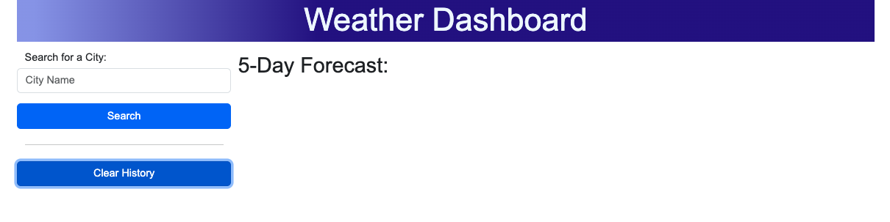

# 05 Third-Party APIs: Work Day Scheduler

Deployed URL: 

GitHUb URL: 


## Your Task

Use the OpenWeather API to create a Weather Dashboard that will run in the browser and feature dynamically updated HTML and CSS that will help a traveller to see the weather outlook for multiple cities to enable trip planning.


## Mockup


## dashboard Function
Display the form input for the city and current and future weather conditions
```
GIVEN a weather dashboard with form inputs
WHEN I search for a city
THEN I am presented with current and future conditions for that city and that city is added to the search history
```


## displayWeather function
Displays both the current weather condition and 5 days forecast condition

### Current Weather Condition
```
WHEN I view current weather conditions for that city
THEN I am presented with the city name, the date, an icon representation of weather conditions, the temperature, the humidity, and the wind speed
```


### 5 Day Forecast Conditions
```
WHEN I view future weather conditions for that city
THEN I am presented with a 5-day forecast that displays the date, an icon representation of weather conditions, the temperature, the wind speed, and the humidity
```


## displayCity function
This function allows the past searches to be displayed and current and future weather information displayed when the historical button is clicked for that moment


## clearSearchHistory function
This function enable the historical searches to be cleared when the "Clear History" button is clicked perhaps used when a different trip is planned




## Future Improvement
I need to stop being carried away and commit more often to enable me to optimise Github functionality


## Reference
https://getbootstrap.com/docs/4.0/components/buttons/

Bootstrap 4 Navbar with Search Form
https://codepen.io/cristinaconacel/pen/gQPYYg

OpenWeatherMap API Tutorial 2021
https://www.youtube.com/watch?v=nGVoHEZojiQ

reset.CSS
http://meyerweb.com/eric/tools/css/reset/


- - -
© 2023 pWongi Confidential and Proprietary. All Rights Reserved.
